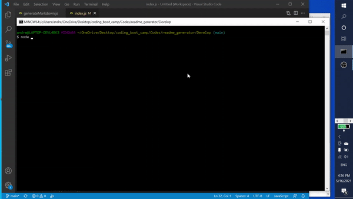
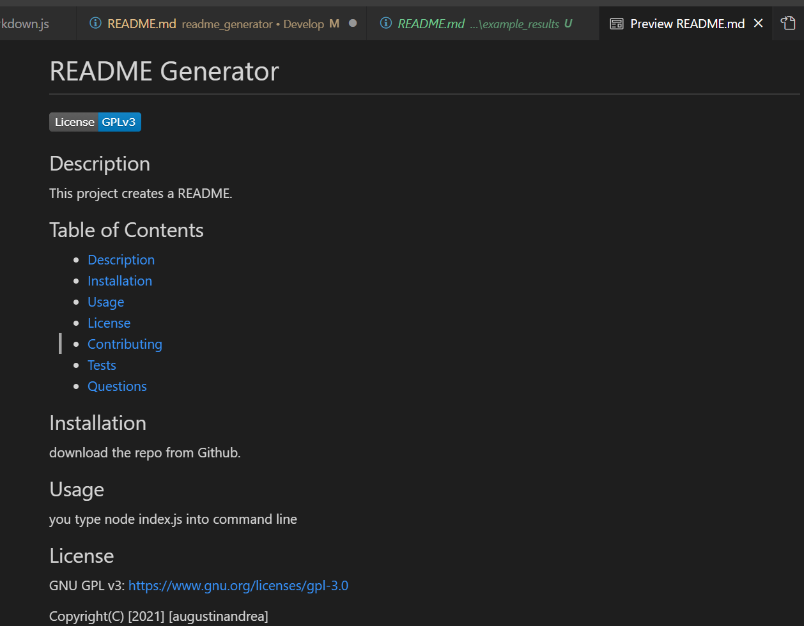
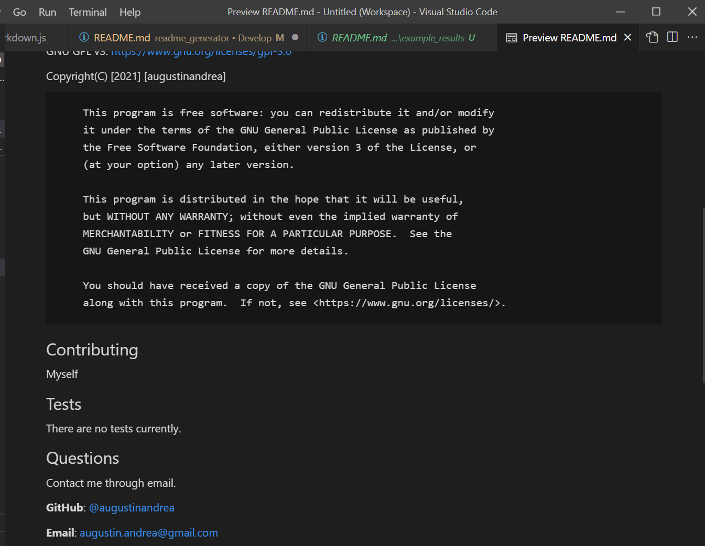

# README Generator Project

  ## Description
  In this project I created a README Generator. The application starts and you are prompted with different questions related to different parts that should exists in a professional README. There is a license badge generated at the top and a license copyright section. There is a video showing an example of the process.
  https://drive.google.com/file/d/1-AlUF_DvNWvEp7DbpX56ubtFBd1IttST/view?usp=sharing

  

  ## Table of Contents
  * [Description](#Description)
  * [Installation](#Installation)
  * [Usage](#Usage)
  * [Contributing](#Contributing)
  * [Tests](#Tests)
  * [Questions](#Questions)

 
  ## Installation
  Download the repo from GitHub.

  ## Usage
  You start the project by going into the Develop folder. Then in the terminal, you type 'node index.js'.

  ## Contributing
  Andrea Augustin

  ## Tests
  I tested the project a couple of times. This is one example:

  
  

  
  ## Questions
  If there is any questions on the project, contact me with the email below.

  **GitHub**: [@augustinandrea](https://github.com/augustinandrea)
  

  **Email**: augustin.andrea@gmail.com

